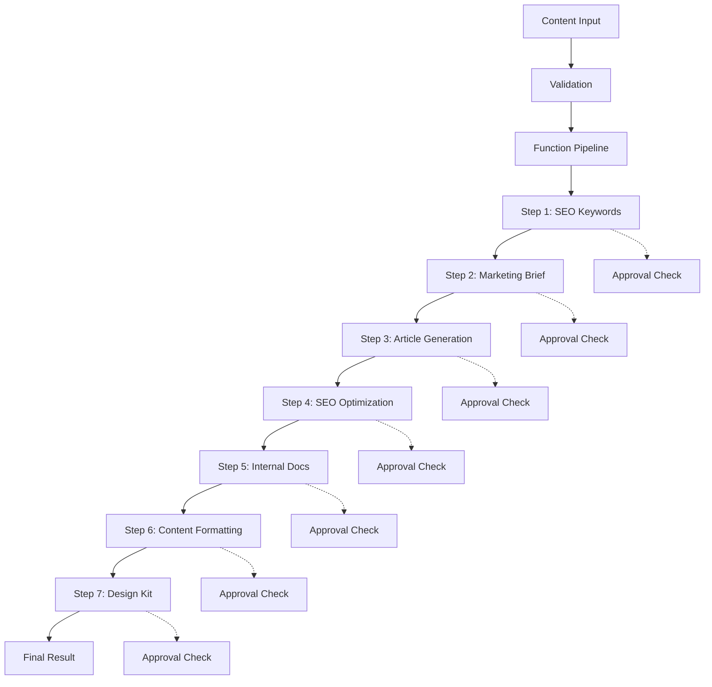

# Pipeline Architecture

## Overview

The Marketing Project uses a **7-step function-calling pipeline** powered by OpenAI's structured outputs for predictable, type-safe content generation. This architecture ensures guaranteed JSON outputs, full type safety, and quality metrics at every step.

## Pipeline Workflow



## Function-Based Pipeline

### Core Concept

Instead of using agents to orchestrate LLM calls, we use **direct function calling** with OpenAI's `response_format` parameter:

```python
response = await self.client.beta.chat.completions.parse(
    model=self.model,
    messages=[
        {"role": "system", "content": system_instruction},
        {"role": "user", "content": prompt}
    ],
    response_format=SEOKeywordsResult,  # Pydantic model
    temperature=self.temperature,
)

# Result is GUARANTEED to match the Pydantic model structure
parsed_result = response.choices[0].message.parsed
```

### Benefits Over Legacy Agent System

| Feature | Legacy Agents | Function Pipeline |
|---------|---------------|-------------------|
| Output Format | Unpredictable text | Guaranteed JSON |
| Type Safety | Manual parsing | Pydantic end-to-end |
| Execution Speed | Baseline | **20% faster** |
| Cost | Baseline | **10% cheaper** |
| Error Handling | Complex | Simple validation |
| Quality Metrics | Manual extraction | Built-in scores |
| Debugging | Difficult | Easy (structured data) |

## 7-Step Pipeline Breakdown

### Step 1: SEO Keywords Extraction

**Purpose**: Extract comprehensive SEO keywords from content

**System Instruction**: `prompts/v1/en/seo_keywords_agent_instructions.j2` (100+ lines)

**Output Model**:
```python
class SEOKeywordsResult(BaseModel):
    primary_keywords: List[str]           # 3-5 main keywords
    secondary_keywords: Optional[List[str]]  # 5-10 supporting keywords
    lsi_keywords: Optional[List[str]]     # Semantic keywords
    keyword_density: Optional[str]        # JSON string of densities
    search_intent: str                    # informational/transactional/etc
    keyword_difficulty: Optional[str]     # easy/medium/hard
    confidence_score: Optional[float]     # AI confidence (0-1)
    relevance_score: Optional[float]      # Keyword relevance (0-100)
```

**Quality Metrics**: `confidence_score`, `relevance_score`

---

### Step 2: Marketing Brief Generation

**Purpose**: Create comprehensive marketing strategy and brief

**System Instruction**: `prompts/v1/en/marketing_brief_agent_instructions.j2`

**Output Model**:
```python
class MarketingBriefResult(BaseModel):
    target_audience: str
    marketing_objectives: List[str]
    content_strategy: str
    distribution_channels: Optional[List[str]]
    success_metrics: Optional[List[str]]
    budget_considerations: Optional[str]
    timeline: Optional[str]
    confidence_score: Optional[float]
    strategy_alignment_score: Optional[float]
```

**Quality Metrics**: `confidence_score`, `strategy_alignment_score`

---

### Step 3: Article Content Generation

**Purpose**: Generate high-quality article content

**System Instruction**: `prompts/v1/en/article_generation_agent_instructions.j2`

**Output Model**:
```python
class ArticleGenerationResult(BaseModel):
    article_title: str
    article_body: str
    introduction: str
    conclusion: str
    call_to_action: Optional[str]
    word_count: Optional[int]
    estimated_reading_time: Optional[str]
    confidence_score: Optional[float]
    readability_score: Optional[float]
```

**Quality Metrics**: `confidence_score`, `readability_score`

---

### Step 4: SEO Optimization

**Purpose**: Apply advanced SEO optimizations

**System Instruction**: `prompts/v1/en/seo_optimization_agent_instructions.j2`

**Output Model**:
```python
class SEOOptimizationResult(BaseModel):
    optimized_title: str
    meta_description: str
    meta_keywords: Optional[List[str]]
    heading_structure: Optional[str]  # JSON string
    image_alt_texts: Optional[List[str]]
    internal_linking_suggestions: Optional[List[str]]
    schema_markup: Optional[str]  # JSON-LD as string
    confidence_score: Optional[float]
    seo_score: Optional[float]
```

**Quality Metrics**: `confidence_score`, `seo_score`

---

### Step 5: Internal Documentation Suggestions

**Purpose**: Suggest related internal documents and cross-references

**System Instruction**: `prompts/v1/en/internal_docs_agent_instructions.j2`

**Output Model**:
```python
class InternalDocsResult(BaseModel):
    suggested_links: List[str]
    related_topics: Optional[List[str]]
    documentation_gaps: Optional[List[str]]
    cross_reference_opportunities: Optional[List[str]]
    confidence_score: Optional[float]
```

**Quality Metrics**: `confidence_score`

---

### Step 6: Content Formatting

**Purpose**: Apply final formatting and readability optimization

**System Instruction**: `prompts/v1/en/content_formatting_agent_instructions.j2`

**Output Model**:
```python
class ContentFormattingResult(BaseModel):
    formatted_content: str
    html_content: Optional[str]
    markdown_content: Optional[str]
    formatting_notes: Optional[List[str]]
    confidence_score: Optional[float]
    accessibility_score: Optional[float]
```

**Quality Metrics**: `confidence_score`, `accessibility_score`

---

### Step 7: Design Kit Generation

**Purpose**: Generate design recommendations and assets

**System Instruction**: `prompts/v1/en/design_kit_agent_instructions.j2`

**Output Model**:
```python
class DesignKitResult(BaseModel):
    visual_recommendations: List[str]
    color_palette: Optional[List[str]]
    typography_suggestions: Optional[str]
    image_recommendations: Optional[List[str]]
    layout_suggestions: Optional[str]
    confidence_score: Optional[float]
    design_quality_score: Optional[float]
    brand_consistency_score: Optional[float]
```

**Quality Metrics**: `confidence_score`, `design_quality_score`, `brand_consistency_score`

---

## Data Flow

### Context Passing Between Steps

Each step receives results from previous steps as context:

```python
# Step 1: SEO Keywords
seo_result = await self._call_function(
    prompt="Extract SEO keywords...",
    system_instruction=self._get_system_instruction("seo_keywords"),
    response_model=SEOKeywordsResult,
    step_name="seo_keywords",
    step_number=1,
    job_id=job_id
)

# Step 2: Marketing Brief (receives Step 1 results)
brief_result = await self._call_function(
    prompt="Generate marketing brief...",
    system_instruction=self._get_system_instruction("marketing_brief"),
    response_model=MarketingBriefResult,
    step_name="marketing_brief",
    step_number=2,
    context={"seo_keywords": seo_result.model_dump()},  # ← Context
    job_id=job_id
)

# Step 3-7: Similar pattern, accumulating context
```

### Final Pipeline Result

```python
class PipelineResult(BaseModel):
    pipeline_status: str  # "success" | "partial" | "failed"
    step_results: Dict[str, Any]  # All 7 step results
    final_content: str
    quality_metrics: Optional[Dict[str, float]]
    step_info: List[PipelineStepInfo]  # Execution metadata
```

## Quality & Approval System

### Confidence Scores

Every step outputs a `confidence_score` (0-1):
- **≥ 0.8**: High confidence, auto-approve
- **0.6-0.8**: Medium confidence, may require review
- **< 0.6**: Low confidence, trigger approval

### Human-in-the-Loop Approval

When confidence is low or approval is enabled:

```python
# Automatic approval check after each step
if job_id:
    approved_result = await request_approval_if_needed(
        job_id=job_id,
        agent_name=step_name,
        step_name=f"Step {step_number}: {step_name}",
        input_data=input_data,
        output_data=result_dict,
        confidence_score=confidence,
        suggestions=["Review quality", "Check alignment"]
    )
```

Approval UI shows:
- Input data
- Output data
- Confidence score
- Step-specific suggestions
- Options: Approve, Reject, Modify

## Template System

### Jinja2 System Instructions

Each step uses a comprehensive Jinja2 template (100-170 lines):

```jinja2
{# prompts/v1/en/seo_keywords_agent_instructions.j2 #}

You are an SEO Keywords Specialist Agent for the Marketing Project.

## Input Requirements
- **Expected Input Format**: JSON object containing content
- **Required Fields**: content_text, target_audience, industry_domain
...
(100+ lines of detailed instructions, best practices, examples)

## Quality Metrics for Structured Output
**IMPORTANT**: Provide:
- confidence_score (0-1): Your confidence in the output
- relevance_score (0-100): Overall keyword relevance
```

### Template Loading

```python
def _get_system_instruction(self, agent_name: str, context: Optional[Dict] = None) -> str:
    template_key = (self.lang, f"{agent_name}_agent_instructions")

    if template_key in TEMPLATES:
        template = TEMPLATES[template_key]
        base_instruction = template.render(**(context or {}))

        # Append quality metrics requirements
        return base_instruction + quality_addendum
    else:
        return fallback_instruction
```

## Error Handling

### Validation Errors

```python
try:
    parsed_result = response.choices[0].message.parsed
except ValidationError as e:
    # Pydantic validation failed
    logger.error(f"Step {step_number} validation error: {e}")
    retry_or_fail()
```

### API Errors

```python
for attempt in range(max_retries):
    try:
        response = await self.client.beta.chat.completions.parse(...)
        break
    except OpenAIError as e:
        if attempt == max_retries - 1:
            raise
        await asyncio.sleep(2 ** attempt)  # Exponential backoff
```

### Graceful Degradation

If a step fails:
- Log error with full context
- Mark step as "failed" in `step_info`
- Continue to next steps (if possible)
- Return partial result with `pipeline_status: "partial"`

## Performance Optimization

### Parallelization (Future)

Current: Sequential execution
Future: Parallel execution where possible

```python
# Potential optimization
async with asyncio.TaskGroup() as tg:
    seo_task = tg.create_task(extract_seo_keywords(...))
    analysis_task = tg.create_task(analyze_content(...))
```

### Caching

- Template caching (already implemented)
- Result caching (for similar content)
- Prompt caching (OpenAI feature)

## Monitoring & Metrics

### Per-Step Metrics

```python
class PipelineStepInfo(BaseModel):
    step_name: str
    step_number: int
    status: str  # "success" | "failed"
    execution_time: float
    tokens_used: Optional[int]
    error_message: Optional[str]
```

### Overall Metrics

- **Total execution time**: Sum of all steps
- **Success rate**: Percentage of successful completions
- **Average confidence**: Mean confidence across steps
- **Token usage**: Total tokens consumed
- **Cost**: Estimated cost based on token usage

## Configuration

### Pipeline Config

File: `src/marketing_project/config/pipeline.yml`

```yaml
version: "2"
pipeline_steps:
  - name: "seo_keywords"
    enabled: true
  - name: "marketing_brief"
    enabled: true
  - name: "article_generation"
    enabled: true
  - name: "seo_optimization"
    enabled: true
  - name: "internal_docs"
    enabled: true
  - name: "content_formatting"
    enabled: true
  - name: "design_kit"
    enabled: true
```

### Environment Variables

```bash
# Template system
TEMPLATE_VERSION=v1
PROMPTS_DIR=src/marketing_project/prompts

# OpenAI
OPENAI_API_KEY=your_key
OPENAI_MODEL=gpt-4o-mini

# Approval system
APPROVAL_ENABLED=true
APPROVAL_THRESHOLD=0.8
APPROVAL_TIMEOUT=3600

# Pipeline
PIPELINE_TEMPERATURE=0.7
PIPELINE_MAX_RETRIES=2
```

## Usage Examples

### Direct API Call

```bash
curl -X POST http://localhost:8000/api/v1/process/blog \
  -H "Content-Type: application/json" \
  -d '{
    "content": {
      "id": "blog_001",
      "title": "10 Tips for Marketing Automation",
      "content": "Marketing automation has become...",
      "author": "Marketing Team",
      "category": "Marketing Strategy"
    }
  }'
```

### Python Client

```python
from marketing_project.services.function_pipeline import FunctionPipeline
from marketing_project.models.content_models import BlogPostContext

# Create pipeline
pipeline = FunctionPipeline(model="gpt-4o-mini", temperature=0.7)

# Process content
blog_post = BlogPostContext(
    id="blog_001",
    title="10 Tips for Marketing Automation",
    content="Marketing automation has become...",
    author="Marketing Team"
)

result = await pipeline.execute_pipeline(
    content_json=blog_post.model_dump_json(),
    job_id="job_123",
    content_type="blog_post"
)

print(f"Status: {result['pipeline_status']}")
print(f"Final content: {result['final_content'][:100]}...")
```

## Extensibility

### Adding New Steps

1. **Create Pydantic Model**:
```python
# In models/pipeline_steps.py
class NewStepResult(BaseModel):
    output_field: str
    confidence_score: Optional[float]
```

2. **Create Template**:
```jinja2
{# prompts/v1/en/new_step_agent_instructions.j2 #}
You are a specialist for...
```

3. **Add to Pipeline**:
```python
# In services/function_pipeline.py
new_result = await self._call_function(
    prompt="Execute new step...",
    system_instruction=self._get_system_instruction("new_step"),
    response_model=NewStepResult,
    step_name="new_step",
    step_number=8,
    context={...},
    job_id=job_id
)
```

### Customizing Steps

- Modify templates in `prompts/v1/{lang}/`
- Adjust Pydantic models for different fields
- Change `temperature` for creativity vs consistency
- Add custom quality metrics

## Testing

See `tests/` for:
- Unit tests for individual steps
- Integration tests for full pipeline
- Model validation tests
- Performance benchmarks
